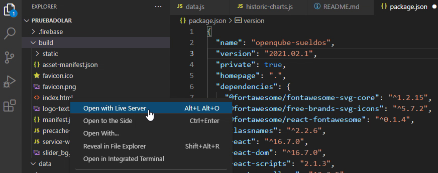
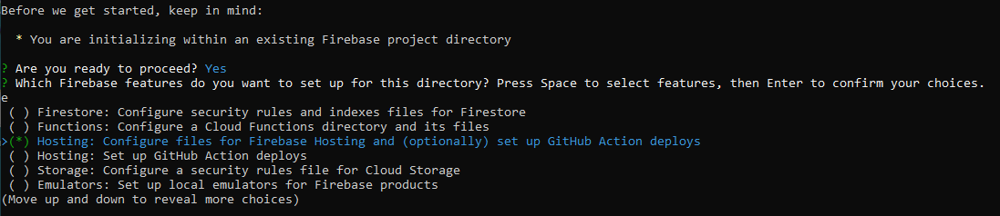

# Análisis de la encuesta Sysarmy
## Edición 2021.02 (2021 - 2do semestre).

## Frontend (React)

A continuación se describe las modificaciones que se realizaron en el código y algunas sugerencias: 

- Descarga del código y despliegue en Local
- Build en Local
- Deploy en Firebase
- Gráficos nuevos
- Dolar ahorro
- Fuentes de datos (para graficar)

## Despliegue en Local (o modo desarrollo)

 Desde el github [https://github.com/openqube/openqube-sueldos](https://github.com/openqube/openqube-sueldos) puede seguir las instrucciones.

Una vez descargado o clonado el proyecto, y dentro de la carpeta tipear:

```jsx
npm install
npm start
```

se abrirá un browser nuevo y podrá interactuar con el código.

## Build en Local

En una primera instancia, le sugerimos que haga un **build** para corrobrar que el código generado funciona (nuevamente esto se detalla en el github).

```jsx
npm run build
```

 Dentro de la carpeta build (abrir  index.html con live Server→VSC) 



En caso que se vea una pantalla en Blanco,  modificar la línea 5 como se indica en la figura.

## Deploy en Firebase

Seguir las instrucciones de [https://firebase.google.com/?hl=es-419](https://firebase.google.com/?hl=es-419) e instalar los paquetes correspondientes, inicializar firebase init (desde terminal)



Aquí el paso más importante en lugar de public colocar *build*


y continuar con el proceso. Ante de realizar el firebase deploy, realizar el

```jsx
npm run build
```

y luego sí firebase deploy. Se le brindara una url donde se hará el deploy

## Gráficos nuevos


## Dolar ahorro

 si al momento de publicar la nueva versión de la encuesta existe un cepo cambiario y  un tipo de cambio desdoblado en oficial/ahorro, agregar la fecha de publicación aquí.


## Fuente de datos

chats.js y historic-charts.js son los archivos donde deberán colocar el código (JSON) generado desde Colab. 


